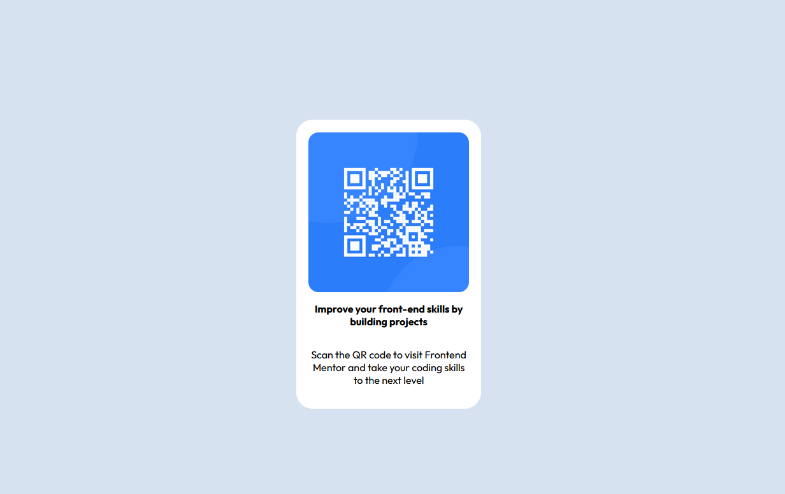

# Frontend Mentor - QR code component solution

This is a solution to the [QR code component challenge on Frontend Mentor](https://www.frontendmentor.io/challenges/qr-code-component-iux_sIO_H).

## Table of contents

- [Overview](#overview)
- [My process](#my-process)
  - [Built with](#built-with)
  - [What I learned](#what-i-learned)
  - [Continued development](#continued-development)

## Overview

This is a QR component, built for the Frontend Mentor challenge. It's made from semantic HTML5 with CSS styling.

### Screenshot

### Links

- Solution URL: [Add solution URL here](https://github.com/IsASecret/FEM-qrcodecomp)
- Live Site URL: [Add live site URL here](https://isasecret.github.io/FEM-qrcodecomp/)

## My process

My goal here is to plan out the elements required for the project, code the html first, then style it with CSS.

### Built with

- Semantic HTML5 markup
- CSS custom properties
- Flexbox

### What I learned

I learned that Flexbox makes positioning single column items super easy, at least for my purposes. The html semantics were pretty simple on this one so most of my time was spent trying to better understand the CSS involved in this.

### Continued development

Definitely new at this, so half of the battle is deciding how to do something, whether or not it's the most efficient or correct choice.
For example, the <main> element is a flex-box container, which made it easy to center the rest of the page content, which works for me but not sure if that's best practice.

I definitely need to work on CSS media queries and a better way to debug them. Probably poking around Firefox's dev tools is the right place but I didn't want to spend too much time on this project.

If I were to improve something on this project, I would make the sizing of the QR code container more responsive, it really is just a single uniform size for most screen sizes.
